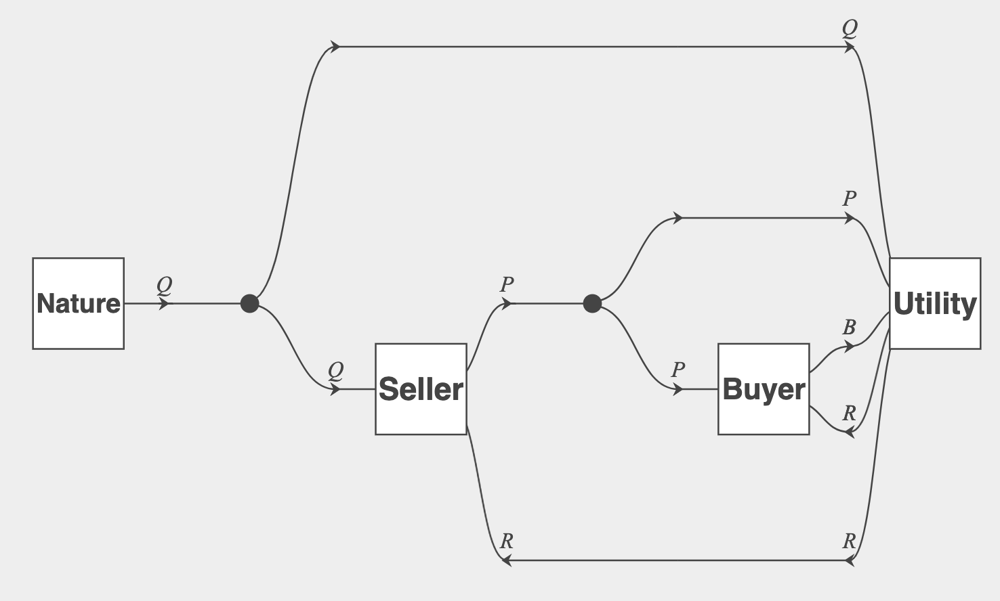

# 36c3 workshop on Open Games

> Workshop @ RIAT, Hall 2 ~ `Monday 14:30 - 16:00`

Open Games is a compositional framework for game theory.

It uses the mathematical theory of (monoidal) categories to describe games.

An introduction to category theory can be found in the [Statebox Monograph](https://papers.statebox.org/#/documents/monograph)

Elements of these things (called morphism) can be expressed as diagrams:

We can use [tools developed at Statebox](https://edit.statebox.cloud) to build these diagrams and export Haskell `Arrow` expressions.

There is a
[backend written in Haskell](https://github.com/jules-hedges/open-games-hs) that can do game theoretic computations based on these diagrams / expressions.

In this workshop we will explain what this does and play around with the backend, and explain its benefits and limitations.
